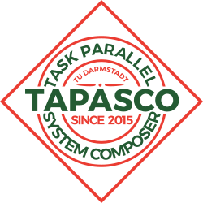

The Task Parallel System Composer (TaPaSCo)
===========================================


System Requirements
-------------------
TaPaSCo is known to work in this environment:

*   Intel x86_64 arch
*   Fedora 24/25, Ubuntu 14.04/16.01
*   Bash Shell 4.2.x+

Other setups likely work as well, but are untested.

Prerequisites
-------------
To use TaPaSCo, you'll need working installations of

*   Vivado Design Suite 2016.2 or newer
*   Java SDK 7+
*   sbt 0.13.x
*   git

If you want to use the High-Level Synthesis flow for generating custom IP
cores, you'll also need:

*   Vivado HLS 2016.2+

Check that at least the following are in your `$PATH`:

*   `sbt`
*   `vivado`
*   `git`
*   `bash`
*   \[`vivado_hls`\]

Install sbt
-----------
Installing multiple versions of Java, Scala and tools like sbt can be a hassle.
[SDKman!](http://sdkman.io/) simplifies the process by managing the
installations without root requirements. To install sbt, simply
```
curl -s "https://get.sdkman.io" | bash
```
Then, run in a new terminal:
```
sdk install sbt
```
Try if this worked, via
```
sbt version
```
If `sbt` was successfully installed, it will return its version number.

Basic Setup
-------------------
1.  Open a terminal in the main directory of the repository and source the
    TaPaSCo setup script via `. setup.sh`.
    You need to do this every time you use TaPaSCo (or put it into your
    `~/.bashrc` or `~/.profile`).
2.  Build TaPaSCo: `sbt compile` (this may take a while, `sbt` needs to fetch
    all dependencies etc. once).
2.  Create the necessary jar files with `sbt assembly`.
4.  Run TaPaSCo unit tests: `sbt test`
5.  _Optional_: Generate sample configuration file: `tapasco -n config.json`
    TaPaSCo should exit immediately and `config.json` will include a full
    configuration that can be read with `--configFile`, including one example
    for each kind of job.

When everything completed successfully, **TaPaSCo is ready to use!**

Acknowledgements
----------------
TaPaSCo is based on [ThreadPoolComposer][1], which was developed by us as part
of the [REPARA project][2], a _Framework Seven (FP7) funded project by the
European Union_.

We would also like to thank [Bluespec, Inc.][3] for making their _Bluespec
SystemVerilog (BSV)_ tools available to us and their permission to distribute
the Verilog code generated by the _Bluespec Compiler (bsc)_.

[1]: https://git.esa.informatik.tu-darmstadt.de/REPARA/threadpoolcomposer.git
[2]: http://repara-project.eu/
[3]: http://bluespec.com/
